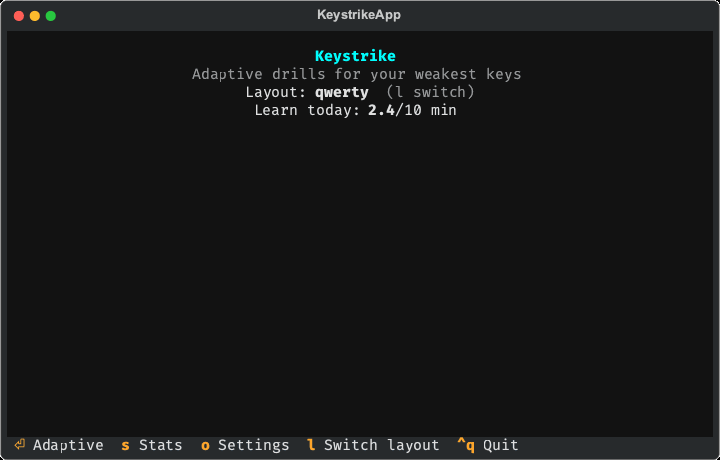

# Keystrike

Adaptive drills for your weakest keys. Inspired by
[keybr.com](https://www.keybr.com/). Per-layout stats stored locally on disk — no
network.



## Features

- **Adaptive engine** — unlocks keys as you hit speed+accuracy targets; drills
  focus on your weakest unlocked key using a Markov word generator.
- **Per-layout stats** — QWERTY, Dvorak, Colemak, and Colemak Mod-DH bundled;
  load custom layouts from `~/.config/keystrike/layouts/*.toml`.
- **Stats heatmap** — per-key speed and error history with session trends.
- **Daily learn budget** — optional cap on adaptive practice minutes per day.
- **Offline** — sessions persist as JSONL under your platform data dir; no
  accounts or cloud sync.

## Install

```bash
uv tool install keystrike
keystrike
```

Or from source:

```bash
git clone https://github.com/egno/keystrike
cd keystrike
uv sync --no-dev
uv run keystrike
```

Requires **Python 3.12+** and a terminal with **raw-mode keyboard input**
(see [Terminal setup](#terminal-setup) below).

## Usage

| Key | Action |
| --- | --- |
| `Enter` | Start adaptive practice |
| `s` | Stats (heatmap + history) |
| `o` | Settings |
| `l` | Cycle keyboard layout |
| `q` / `Ctrl+C` | Quit |

Settings let you pick layout, target speed (WPM or CPM), alphabet size
(letters force-unlocked at cold start), and daily learn minutes.

Data lives under platformdirs paths (typically `~/.config/keystrike` and
`~/.local/share/keystrike` on Linux, `~/Library/Application Support/keystrike`
on macOS).

## Terminal setup

Keystrike uses Textual's raw-mode input to capture every keystroke. This works
out of the box in **macOS Terminal.app**, **iTerm2**, and most Linux terminals.

### Windows

Use **[Windows Terminal](https://apps.microsoft.com/store/detail/windows-terminal/9N0DX20HK701)**
(WT) — the legacy conhost window has unreliable raw-mode support. WT is the
supported target on Windows; other emulators may work but are untested.

If keys don't register or the cursor behaves oddly:

1. Update Windows Terminal to the latest release.
2. Run `keystrike` inside WT, not cmd.exe or the old console host.
3. Avoid running through terminal multiplexers on Windows until verified.

Raw-mode input has **not** been verified on every Windows build — please
[open an issue](https://github.com/egno/keystrike/issues) if something breaks.

## Development

Runtime deps live in `[project] dependencies`. Dev tools are uv
`dependency-groups` — `dev` (pure Python, synced by default), `lint`
(Ruff; desktop only), and `snapshot` (visual regression; desktop only).

### Runtime only

```bash
uv sync --no-dev
uv run keystrike
```

### Dev (tests + typecheck)

Includes the `dev` group (pytest, pyright, …). Safe on Android/Termux — all
pure-Python wheels, no Ruff/maturin:

```bash
uv sync
uv run pytest -q
uv run pyright
```

### Full dev (desktop)

Also installs `lint` (Ruff) and optionally `snapshot`
(`pytest-textual-snapshot`):

```bash
uv sync --all-groups
uv run ruff check
uv run pytest tests/presentation/test_snapshots.py -q
```

Keep native-wheel dev tools out of `dev` (e.g. `hypothesis` — Rust wheels, no
Android tag; `pytest-textual-snapshot` → `markupsafe`; Ruff → `maturin`).

Regenerate the README demo GIF after snapshot changes:

```bash
uv sync --group snapshot
uv run pytest tests/presentation/test_snapshots.py --snapshot-update
uv pip install pillow cairosvg  # one-off; needs system cairo on macOS/Linux
uv run python scripts/generate_demo_gif.py
```

## License

MIT
